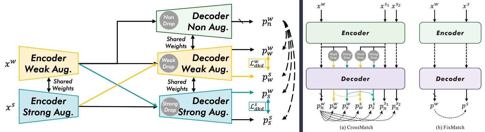
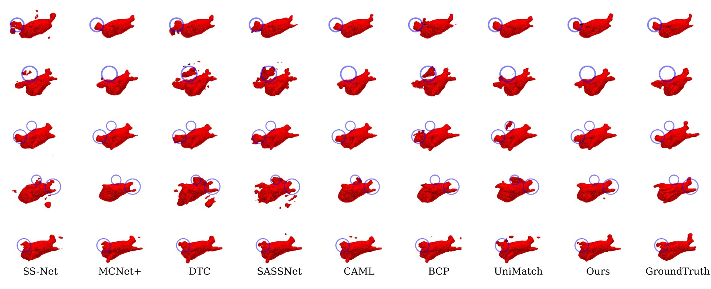

## CrossMatch
Code for this paper: CrossMatch: Enhance Semi-Supervised Medical Image Segmentation with Perturbation Strategies and Knowledge Distillation

🎉🎉🎉 This paper has been accepted by IEEE Journal of Biomedical and Health Informatics !

> CrossMatch Paper: [](https://ieeexplore.ieee.org/document/10684089) [](https://arxiv.org/abs/2405.00354)


	
## Requirements

1. Create conda environment:
   ```bash
   conda create -n CrossMatch python=3.11
   ```
2. Clone the repo:
   ```bash
   git clone https://github.com/AiEson/CrossMatch.git
   ```
3. Activate the environment:
   ```bash
   conda activate CrossMatch
   ```
4. Install the requirements:
   ```bash
   cd CrossMatch
   pip install -r requirements.txt
   ```

## Usage
### LA dataset
One click to run:
```bash
cd LA/code
bash train.sh
```

### ACDC dataset
One click to run:
```bash
cd ACDC
bash scripts/train.sh gpu_num port
# like `bash scripts/train.sh 4 12333` for 4 GPUs and port 12333
```

## Results
### LA dataset results

* The training set consists of 8 labeled scans and 72 unlabeled scans and the testing set includes 20 scans.

| **Method**                | **Reference** | **Dice(%)↑** | **Jaccard(%)↑** | **95HD(voxel)↓** | **ASD(voxel)↓** |
|---------------------------|---------------|--------------|-----------------|------------------|-----------------|
| UA-MT         | (MICCAI'19)   | 85.81        | 75.41           | 18.25            | 5.04            |
| SASSNet    | (MICCAI'20)   | 85.71        | 75.35           | 14.74            | 4.00            |
| DTC            | (AAAI'21)     | 84.55        | 73.91           | 13.80            | 3.69            |
| MC-Net       | (MICCAI'21)   | 86.87        | 78.49           | 11.17            | 2.18            |
| URPC          | (MedIA'22)    | 83.37        | 71.99           | 17.91            | 4.41            |
| SS-Net       | (MICCAI'22)   | 86.56        | 76.61           | 12.76            | 3.02            |
| MC-Net+ | (MedIA'22)    | 87.68        | 78.27           | 10.35            | 1.85            |
| DMD            | (MICCAI'23)   | 89.70        | 81.42           | 6.88             | 1.78            |
| BCP     | (CVPR'23)     | 89.55        | 81.22           | 7.10             | 1.69            |
| UniMatch  | (CVPR'23)     | 89.09        | 80.47           | 12.50            | 3.59            |
| CAML          | (MICCAI'23)   | 89.62        | 81.28           | 8.76             | 2.02            |
| Ours                      |               | **91.33**   | **84.11**      | **5.29**        | **1.53**       |

* The training set consists of 16 labeled scans and 64 unlabeled scans and the testing set includes 20 scans.

| **Method**               | **Reference** | **Dice(%)↑** | **Jaccard(%)↑** | **95HD(voxel)↓** | **ASD(voxel)↓** |
|---------------------------|-------------|----------|-------------|--------------|-------------|
| UA-MT         | (MICCAI'19) | 88.18    | 79.09       | 9.66         | 2.62        |
| SASSNet    | (MICCAI'20) | 88.11    | 79.08       | 12.31        | 3.27        |
| DTC            | (AAAI'21)   | 87.79    | 78.52       | 10.29        | 2.50        |
| MC-Net       | (MICCAI'21) | 90.43    | 82.69       | 6.52         | 1.66        |
| URPC          | (MedIA'22)  | 87.68    | 78.36       | 14.39        | 3.52        |
| SS-Net       | (MICCAI'22) | 88.19    | 79.21       | 8.12         | 2.20        |
| MC-Net+ | (MedIA'22)  | 90.60    | 82.93       | 6.27         | 1.58        |
| DMD            | (MICCAI'23) | 90.46    | 82.66       | 6.39         | 1.62        |
| BCP     | (CVPR'23)   | 90.18    | 82.36       | 6.64         | 1.61        |
| UniMatch  | (CVPR'23)   | 90.77    | 83.18       | 7.21         | 2.05        |
| CAML          | (MICCAI'23) | 90.78    | 83.19       | 6.11         | 1.68        |
| Ours                      |             | **91.61**    | **84.57**       | **5.36**         | **1.57**        |

### ACDC dataset results
* The training set consists of 3 labeled scans and 67 unlabeled scans and the testing set includes 20 scans.
  
| **Method**               | **Reference** | **Dice(%)↑** | **Jaccard(%)↑** | **95HD(voxel)↓** | **ASD(voxel)↓** |
|--------------------------|---------------|--------------|-----------------|------------------|-----------------|
| UA-MT        | (MICCAI'19)   | 46.04        | 35.97           | 20.08            | 7.75            |
| SASSNet   | (MICCAI'20)   | 57.77        | 46.14           | 20.05            | 6.06            |
| DTC           | (AAAI'21)     | 56.90        | 45.67           | 23.36            | 7.39            |
| MC-Net      | (MICCAI'21)   | 62.85        | 52.29           | 7.62             | 2.33            |
| URPC         | (MedIA'22)    | 55.87        | 44.64           | 13.60            | 3.74            |
| SS-Net      | (MICCAI'22)   | 65.82        | 55.38           | 6.67             | 2.28            |
| DMD           | (MICCAI'23)   | 80.60        | 69.08           | 5.96             | 1.90            |
| UniMatch | (CVPR'23)     | 84.38        | 75.54           | 5.06             | 1.04            |
| Ours                     |               | **88.27**    | **80.17**       | **1.53**         | **0.46**        |
---
* The training set consists of 7 labeled scans and 63 unlabeled scans and the testing set includes 20 scans.

| **Method**               | **Reference** | **Dice(%)↑** | **Jaccard(%)↑** | **95HD(voxel)↓** | **ASD(voxel)↓** |
|--------------------------|---------------|--------------|-----------------|------------------|-----------------|
| UA-MT        | (MICCAI'19)   | 81.65        | 70.64           | 6.88             | 2.02            |
| SASSNet   | (MICCAI'20)   | 84.50        | 74.34           | 5.42             | 1.86            |
| DTC           | (AAAI'21)     | 84.29        | 73.92           | 12.81            | 4.01            |
| MC-Net      | (MICCAI'21)   | 86.44        | 77.04           | 5.50             | 1.84            |
| URPC         | (MedIA'22)    | 83.10        | 72.41           | 4.84             | 1.53            |
| SS-Net      | (MICCAI'22)   | 86.78        | 77.67           | 6.07             | 1.40            |
| DMD           | (MICCAI'23)   | 87.52        | 78.62           | 4.81             | 1.60            |
| UniMatch | (CVPR'23)     | 88.08        | 80.10           | 2.09             | **0.45**       |
| Ours                     |               | **89.08**   | **81.44**      | **1.52**        | 0.52            |

### Qualitative results


## Citation
If you find this project useful, please consider citing:
```bibtex
@ARTICLE{CrossMatch,
  author={Zhao, Bin and Wang, Chunshi and Ding, Shuxue},
  journal={IEEE Journal of Biomedical and Health Informatics}, 
  title={CrossMatch: Enhance Semi-Supervised Medical Image Segmentation with Perturbation Strategies and Knowledge Distillation}, 
  year={2024},
  volume={},
  number={},
  pages={1-13},
  keywords={Perturbation methods;Data models;Predictive models;Biomedical imaging;Decoding;Accuracy;Training;Semi-supervised segmentation;Self-knowledge distillation;Image perturbation},
  doi={10.1109/JBHI.2024.3463711}}
```

## Acknowledgement
* This code is adapted from [UA-MT](https://github.com/yulequan/UA-MT), [DTC](https://github.com/HiLab-git/DTC.git) and [UniMatch](https://github.com/LiheYoung/UniMatch/tree/main/more-scenarios/medical) . 
* We thank Lequan Yu, Xiangde Luo and Lihe Yang for their elegant and efficient code base.
